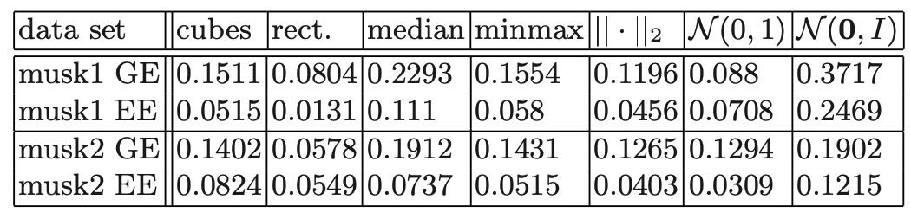

# CSDS 440 Final Project Writeup
## Survey
### Introduction
Multiple Instance Learning (MIL) is a powerful paradigm in machine learning that comes in handy when there are scenarios when what you are trying to classify is inherently ambiguous/incomplete. In a standard supervised classification problem, a machine learning model's goal is to classify the class of the target instance. However, MIL opeartes on bags of instances where bags are labelled contrary to the instances. In order to classify the bags, instances are considered collectively, allowing for a more flexible and robust learning framework. There are many models operate on these problems using the single instance learning (SMI) assumption, where each bag is classified positive there is at least one positive instance iwthin the bag. 

MIL problems are formatted in a certain way: Bags: $B$, Instance space: $X \rightarrow \{+1,1\}$ where $x_i \in X$ where $x_i$ is an instance that is either positive (+1) or negative (-1), and there exists a function $f$ that maps that instance to a class. $$y(B)=+1 \iff \exists x\in B: y(x)=+1$$ However, this is only true under the SMI assumption. 

There are obviously more complex problems. For example, there could be problems where a bag is classified as positive if it contains only one type of instance and negative if there is a mixture of types. There other useful MIL paradigms that are optimal for this. However, the algorithms that I worked on focused more on instance-level learning. 

### A Boosting Approach to Multiple Instance Learning [1]
The goal of this paper is to apply a boosting framework to the MIL problem. Boosting is a technique in machine learning where multiple weak learners (models that perform only slightly better than random chance: accuracy > 0.5) are combined to form a stronger model. This is done by using two different types of weights $\alpha_h$ and $w_B$, where $\alpha_h$ denotes the weight of the hypothesis and $w_B$ denotes the weight of the bag (importance to classify it correctly compared to other examples). In the framework of a MIL problem, there are bags $B\in \textbf{B}$ and a set of hypotheses $H$. In order to combine the prediction of classifiers, the final prediction will be: $$h_f(B):=sgn(\sum_{h\in H\prime}\alpha_h h(B))$$

In order to obtain $\alpha$ and $w$, there is an iterative process. $\alpha_h$ is calculated using the error of the respective hypothesis $h$. $w_B$ is recalculated putting more weight on bags that are misclassified. In each iteration, the weights of the bags should normalized so they sum to 1. A new metric is used to help quantify the quality of a weak hypothesis: *distribution accuracy*: $$D(h,w):=\sum_{B\in \textbf{B}: h(B)=y(B)}w_B$$ Given a hypothesis and the corresponding distribution of bag weights, it's accuracy is the sum of the weight of all the bags it classifies correctly. A hypothesis $h\in H$ classifies a bag $B$ as such:

```math
h(B) :=
\begin{cases}
+1 & \text{if } h \cap B \neq \emptyset \\
-1 & \text{otherwise}
\end{cases}
```

They considered the instance space: $X=\mathbb{R}^n$ and the weak hypotheses are "balls" with an arbitrary center and radius: $h(x,r)$ where $x$ is the center with radius $r$. So, a bag is classified as positive if there exists an instance that lies within the radius of the ball. The paper also proves that there always $\exists h$ such that the $D(h,w)\ge \frac{1}{2}+\epsilon$ for some fixed $\epsilon$.
#### Algorithm
Now to determine our weak hypotheses, we iterate through each $x$ in a postive bag $B \in \textbf{B}$. Our goal is to find an optimal radius such that $$r_0=max\{r\prime>0|D(h(x,r\prime),w)=max_r D(h(x,r),w)\}$$ where the the metric to deduce the radius is either the 2-norm or the $\infty$-norm.Because computing the optimal radius for every "positive" instance (any instance in a positive bag) takes a lot of time, it is possible to compute the distance of every bag $B\in \textbf{B}$ and be sorted as in increasing order using this metric: $$d(x,B)=min_{x_0\in B}d(x_0,x)$$ So we are finding the point in each bag closest to our center, and then setting that "distance" as a radius to compare. By sorting it, we know that as the radius increases from bag to bag, we don't have to compute which bags are positive and negative every iteration as we increase the radius, since we already know the order of distances. 

#### Extension of the Optimal Hypercube
If we use the $\infty$-norm, the ball results in an axis-parallel hypercube. However, because the otpimal radius was computed with the distribution accuracy in mind, the accuracy will obviously decrease as the radius increases (more and more negative bags will be classified as positive since it is more likely that instances will lay within the hypercube). So they came up with a way to optimally tune the radius: because a bad instance in a bag may prematurely stop the hypercube from growing, they designed a method in order to grow the hypercube into a hyper-rectangle such that the other dimensions of the rectangle are grown that aren't blocked by the bad instance. 

1. Initialize an optimal hypercube $h(x,r_0). Let the set $F$ contain the directions already set and each direction is represented by the index of an instance and a sign representing whether it's the positive/negative direction of the instance. $F:=\emptyset$
2. Find a bad instance $x\prime$ which is on the decision boundary of the hypothesis $R$.Bad instance being: $x' \in B'$ such that $y(B')=-1$ and $B'\cap R=\emptyset$.If there are multiple instances, just pick any of them.
3. Update $F$ using the following"
- $(i,+)\in F\iff x_i'=b_i$
- $(i,-)\in F\iff x_i'=a_i$
4. Then repeat the process as before finding the optimal radius: find another instance to grow the radius in a direction that is not fixed.
5. Update $R$:
```math
a_i := 
\begin{cases}
a_i & \text{if } (i, -) \in F \\
x_i - r & \text{otherwise}
\end{cases}
```
```math
b_i :=
\begin{cases}
b_i & \text{if } (i, +) \in F \\
x_i + r & \text{otherwise}
\end{cases}
```
6. Repeat 2-5 until each direction is set or $r=\infty$.

#### Experiments
The authors worked with three datasets:
1. **Musk data set**
    - This data set provides different conformations of a certain molecule (molecules are the bags), and the goal is to determine whether the molecule is 'musk-like', will it bind to a certain protein (positive bag).
2. **Robot data set**
    - This data set provides 12 learning problems (28 bags divided into 4 categories: A,B,C,D) where the goal is to learn hypotheses that are able to separate four groups from any two of others.
3. **The protein dataset**
    - This data set comprises of 20 positive bags each associated with 8 distinct groups of 20 and 28 different negative bags, respectively.

They used the following combinations metrics for radius/data preprocessing:
- **Cubes**: the weak hypotheses used the $\infty$-norm (no normalization of data)
- **Rectangles**: the weak hypotheses are axis-parallel hyper-rectangles using the approach described above.
- **Median**: The data was preprocessed by linearly transforming each coordinate mapping it to [-1,1]. The weak hypotheses were hypercubes.
- **Minmax**: The data was preprocessed linearly transforming each coordinate mapping the [min,max] of each coordinate to [-1,1]. The weak hypotheses were hypercube.
- $||\cdot||_2$: 2-norm balls were used as weak hypotheses
- $N(0,1)$: Each coordinate was linearly transformed to achieve mean 0 and variance 1. The weak hypotheses were 2-norm balls
- $N(0,I)$: A linear transformation was applied on all instances such that the mean of all attributes were 0 and the covariance matrix was the identity. The weak hypotheses were 2-norm balls.

The following figures described the results:


Figure 1 reveals the generalization error of the boosting approach on the robot data.



Figure 2 describes the data obtained from 10-fold cross-validation of the algorithm ran on musk data, and the values were averaged across all runs. It shows the generalization error (GE) and estimated error (EE) for the different combinations of metrics/feature normalization.


Figure 3 reveals the generalization error of the boosting approach compared to two other methods for the musk data. It shows that it is quite comparable to the other MIL models.


Figure 4 displayes the generalization error of the boosting approach and another model [23] (can be found in the citation for this table) for the protein data.

#### Conclusion
From the results of these experiments, it can be shown that the boosting framework applied on MIL algorithms works quite well.

### MIForests: Multiple-Instance Learning with Randomized Trees [2]
This paper introduces a novel MIL algorithm, MIForests, which extends the use of random forest to the MIL paradigm. The reason for using RF is due to its advantages in classification/clustering, good performance on high-dimensional data, efficiency in training and evaluation, pralleliability for multi-core GPU implementations, inherent multiclass capability, and robustness against lable noise. MIForests adapt RF by treating class labels of instances within bags as unknown, treating them as random variables defined over a space of probability distributions. 

Random Forests (RFs) are made up of ensembles of $M$ independent decision trees $f_m(x): X\rightarrow Y = \{1,\ldots,K\}$. A forest is denoted as $F=\{f_1,\ldots,f_M\}$ and its predictive confidence is $F_k(x)=\frac{1}{M}\sum_{m=1}^Mp_m(k|x)$. $p_m(k|x)$ is the approximated density of class lables at the leaf node of the $m$-th tree, where sample $x$ is. We label $x$ by finding the labeling with the highest predicted confidence: $C(x)=argmax_{k\in Y}F_k(x)$. In another paper, it was proven that the generalization error of RF is upper bounded by $\bar{\rho}\frac{-1-s^2}{s^2}$ where $\bar{\rho}$ is the pairwise correlation between trees in the forest. $s$ is the expected value of the margin over the entire distribution. Trees are built using an impurity measurement to find the best best split node for the given feature vectors.
 
 MIForests are "functions" or classifiers: $F(x):X\rightarrow Y = \{1,\ldots,K\}$. The difficulty in using RF for MIL is to maintain diversity with the trees $\bar{\rho}$. The algorithm treats the instance labels as optimization variables (the goal is to reveal the true labels of the instances), which result in a classifer being able to learn both instances and bags. Let $B_i$ for $i=1,\ldots,n$ denote the $i$-th bag in the training set labeled $y_i$. $\{x_i^1,\ldots,x_i^{n_i}\}$ are the $n_i$ instances within bag $B_i$. Thus, the optimization function is:
 $$(\{y_i^j\}^*, F^*)=argmin_{\{y_i^j\},F(\cdot)}\sum_{i=1}^n\sum_{j=1}^{n_i}l(F_{y_i^j}(x_i^j))$$ 
 such that $$\forall i:\sum_{j=1}^{n_i}\mathbb{I}(y_i=argmax_{k\in Y}F_k(x_i^j))\ge 1$$
 The goal of the optimization function is to minimize $l(\cdot)$. $F_k(x)$ denotes the confidence of the classifier of the $k$-th class. $\Rightarrow F_k(x)=p(k|x)-\frac{1}{K}$, The classification margin of an instance: $$m(x,y)=p(y|x)-max_{k\in Y, k\ne y}p(k|x)=F_y(x)-max_{k\in Y, k\ne y}F_k(x)$$. This means that in order to have a correct classification, $m(x,y)$ must be greater than 0. The optimization process is inspired by deterministic annealing (DA).

 #### Optimization
 Deterministic annealing minimizes non-convex combinatorial optimization problems efficiently by gradually reducing the level of randomness in the optimization process. In this case, the goal is to minimize entropy $H$ of the distribution $p$: $$p^*=argmin_{p\in P}E_p(F(y))-TH(p)$$ Within the equation $F(y)$ is the objective function and $P$ is the space of probabiltiy distributions. $T$ is a cooling parameter such that $T_0 > T_1 > \ldots > T_\infty = 0$. 

 We initially train a naïve RF that without considering MIL constraints. RF will use the assigned bag labels as labels for the instances within the corresponding bags. Then, for iterations after, we view the instance labels within the target bags as binary variables. In this revised setup, our goal is to find a distribution $\hat{p}\in P$ for each bag such that it solves the optimization problem. After arbitrarily selecting instance labels for a bag, the instance with the highest $\hat{p}$ is set equal to the bag label. Then train all the trees using the pseudcode below:

 
 
 After training, the goal is to find the optimal distribution according to:
 $$\hat{p}^*=argmin_{\hat{p}}\sum_{i=1}^n\sum_{j=1}^{n_i}\sum_{k=1}^K\hat{p}(k|x_i^j)l(F_k(x_i^j))+T\sum_{i=1}^nH(\hat{p}_i)$$

 As many min/max problems, we set take the derivative $\frac{d}{dp}$ and set it equal to 0. This is an offline algorithm trained by optimizing $F$ and then optimizing the distribution $\hat{p}$ over the bags. In the next section, the author describes modifications to allow for on-line learning (if bags arrived in a certain order rather than one large batch).

 To create the ensemble of trees, a Poisson distribution can be used to model the the incoming bags using a $\lambda$ constant value. Essentailly, this approach enables the continuous incorporation of new samples into the model. The algorithm initializes trees with root nodes and arbitrarily chooses $f_i$ (node tests) and thresholds $\theta_i$. At each node, an on-line estimation is made using Gini Index: $G_i=\sum_{i-1}^Kp_i^j(1-p_i^j)$ where $p_i^j$ is the label density of class $i$ in node $K$. After each update, $\Delta G$ (information gain) is measured and compared to a threshold $\beta$. If it's greater than the threshold, the node branch into two leaf nodes and no longer updates. This process continues until we reach the maximum depth. 

 #### Experiments
Experiments were ran in order to test MIForest against other MIL algorithsm on common datasets like Musk1 and Musk2. The table below shows the results:

As it can be observed, MIForest performs the best on the Elephant and Fox datasets and fairly decent on the Tiger/Musk1/Musk2 datasets.

They did another experiment on a image classification dataset. Each image corresponds to a bag consisting of instances obtained from oversegmentation. The dataset is composed of 2000 images and 20 different categories so different classes. Most approaches use 20 1-vs.-all classifiers because they can only train for binary classification. On the other hand, the authors only used one multi-class forest, obviously more difficult, and the algorithm performed quite competitively against the original algorithm developed for these data sets.


The right columns represent the time it takes to run the algorithm, so it can be seen that MIForest is quite computationally efficient. 

In another experiment, the authors wanted to test out on-line learning using an object tracking dataset. MILBoost is known to be among the best tracking methods currently known, so the fact that MIForest is able to outperform MILBoost on 6 out of the 8 sequence datasets is a statement on MIForest's ability.


### Comparison of algorithms mentioned in the paper: AdaBoost vs. MIForest

## Methods
The algorithm that I implemented was the adaboost framework applied on weak MIL learners. The specifics of the algorithm are described more closely in the survey, but in this section, I will go through the methods that I implemented.

As I fit the algorithm to the data, I am storing and updating iteratively the weights of the bags and the weight of the hypotheses. Furthermore, I am also storing the optimal radius of each weak hypothesis (each instance in a positive bag). At the beginning of the algorithm (during the training), I am iterating through each bag. If the bag is positive, then I will go through each example within that bag and compute the optimal radius for that instance to every other bag. This is in order to have a weak learner in order to combine for a strong classifier in the end. In the algorithm, if I classify a bag as positive, it will be given the number +1, and if it is negative, it will be given the number -1. 

1. For each 'positive' instance, I am going to iterate through every other bag and compute a distance vector, each entry denoting the distance from the current 'center' to that point in the other bag. Then, I will pick the smallest entry, and store the bag number and distance as a potential radius of the hypothesis.
2. After all weak hypotheses' center and potential radii have been learned, I am going to iterate through each hypothesis. For each hypothesis, I am going to sort the outside bags by the ones closest and then to the farthest. Then, beginning with the shortest, I am going to calculate the distribution accuracy. So as I iterate through the bags, every bag before the current bag will be labeled as positive, and every bag after the current one will be listed as negative. Before and after in this context is with respect to the sorted array. This is because everything before the current bag will be within the radius set at the current bag causing those bags to be labelled as positive and everything after the current bag will be outside the radius, causing them to be labelled negative. Then I calculate the optimal bag using the distribution accuracy formula: the sum of the weight of the correctly classified bags. 
3. After picking the optimal radius, I am going to then beging the classification process in order to establish an $\alpha$ (hypothesis) and $w$ (bag) weight. I will initialize all the bag weights as even, so 1/number of bags.
4. Beginning with the first hypothesis, I am going to classifying all the bags (using the previously sorted array of bags), and then based on the error of the classification, I will reweight the bags, in order to prioritize classifying the incorrectly labelled bags correctly with the next classifier. This is using the formula: $w_i' = w_i*exp(\alpha\cdot I(y_i\ne h_m(B_i)))$. Then the weight of the classifier will also be updated: $\alpha_m = log((1-err_m)/err_m)$ where $err_m = \frac{\sum_{i=1}^Nw_iI(y_i\ne G_m(x_i))}{\sum_{i=1}^N w_i}$. After the weights have been updated, I will normalize the distribution of $w_B$ so they sum up to 1. 
5. So the goal of this training process was to establish an optimal radius for the weak hypotheses and the optimal weight of the weak hypotheses in the grand scheme of the adaboost learner. After we iterate through all the weak lerners, the adaboost classifier is finished training. Then the final classifier's prediction will be made using this formula: $$h_f(B):=sgn(\sum_{h\in H\prime}\alpha_h h(B))$$
[3] was referenced for the update values of $\alpha$ and $w$.
## Research
I attempted two research methods:
1. Various distance metrics
2. Limiting the number of hypotheses

#### Distance metrics:
I attempted four different metrics: *euclid, chebyshev, cosine, and minkowski*. From my results, euclidean did by far the best. In the paper, the author described the $\infty$-norm it would represent a axis-parallel hypercube. However, the $\infty$-norm did not seem to do well in the musk data set. I used two other distance metrics, cosine and minkowski. However, on the artificially generated dataset where the goal is to be able to determine whether a set of points generated were generated by a linear generator or not. As we can see in the table below, The $\infty$-norm actually performs the best among all the metrics. In the paper, the euclidean distance is analagous to the 2-norm/ball. The goal in trying out this trivial extension was to be able to determine whether different metrics would perform better at higher dimensions. I believe that the metrics (excluding cosine) performed well on the artificial dataset is because the dataset was only set in 2 dimensions: $x_1, x_2$. 

For the next part of the research extension, I attempted to limit the number of hypotheses that adaboost would train on. What this means in the context of MIL, is that it would not establish each instance in a positive bag as a center for a hypothesis. The motivation behind this is because it would become a lot more compuationally efficient if I limited the number of times the model would have to calculate a distance matrix/distribution accuracy. Because adaboost inherently is built off of iterating through the dataset multiple times in order to obtain a strong final hypothesis built off of many weak hypothesis, it would take a very long time to run. For example, for the dataset concerning generating the linear/cubic/quadratic data, because we are generating 10 points for each bag and for each function we are generating x bags, as we increase the number of bags per function, the number of positive instances increases by 10*n where n is the number of bags per function. So having 1000 bags per function would cause there to be 10000 hypotheses, where we would have to compute the optimal radius by comparing the distance of that one point to every other point. I was able to speed up the computation time based on the hyperparameter that I set: max_num_hypothesis. Furthermore, I wanted each bag to have an even number of hypothesis. Because of the SMI assumption (there only requires one positive instance for a bag to be labeled positive), I believed that it would be better to have more distributed assortment of hypotheses rather than all the hypotheses to be concentrated in one bag (based on the way I was iterating through each bag). 

## Results, Analysis, and Discussion

Datasets:
We mainly used two datasets for testing: the musk data set, which I described in the survey section as it is a commonly used dataset. The other dataset is an artificially generated dataset. We generated 3 lines: linear ($y=x$), quadratic ($y=x^2$), and cubic ($y=x^3$). Then a bag would represent a set number of points from a line. Each bag would be one of the lines. So the goal is to learn the lines so that given a set of points, we would be able to classify which line generated those points. 

#### Artificial Dataset
In terms of the experiments that I attempted, all the experiments that I attempted are in the jupyter notebook. So using the adaboost classifier, I would train it on each of the certain type of lines, and the see if one of the datasets was harder to classify than the other. I typically got pretty strong results with accuracies bouncing between 0.95 and 1. However, there are certain anomalies that occur when I train the data on fewer bags. I believe this is due to the random generation of points. If many points from a positive bag were generated near the origin between 0 and 1, it would begin to misclassify the other types of points. However, by looking at the graph of the three lines, this would make a lot of sense because all three lines intersect when x is equal to 0 and 1. So a classifier should not really be able to have much confidence when it comes to points within that area. So I trained the data with varying number of bags per function, and it can be seen that from 10 to around 70 bags, it increases pretty monotonically. However, after that, it does start to jump around a bit more but still nearing 0.95 (look at the jupyter notebook). There was an outlier of 0.777 and 0.57 accuracy as the number of bags reached 200. I am not sure why in this instance; however, each time I ran this experiment, there would be a different set of results. But the trend taht as the number of bags increases, so does the accuracy, so I believe that the nature of the outliers is due to the randomness of the data. With 5-fold CV, I am also getting super competitive results of 0.97 accuracy with a standard deviation of 0.019.

#### Musk Dataset
For the musk dataset, I was obtaining consistently 96-98% accuracy. For 5-fold cross validation I am obtaining mean accuracy of 0.84 and a standard devaition of 0.11.


#### Research Results
Below are the metrics that I obtained for the varying metrics.

| Metric | Musk| Artificial |
| ---- | ---- | ---- |
| Euclid | 0.9674 | 0.947 |
| Chebyshev | 0.489 |  0.997 |
| Cosine | 0.489 | 0.67 |
| Minkowski | 0.489 | 0.96 |

By reducing the number of hypothesis, it could also prevent overfitting because it would capture less noise. From the experiments that I tested, for bags_per_function, the accuracy would be the same at near 95%; however, the training time was cut by way more 10x when I set the number of hypotheses to 200. It went from a minute and a half to 9.6 seconds. However, sometimes the accuracy would drop to less than 0.6 and this could also be attributed to the randomness of the data and points chosen as weak hypotheses.

## Conclusion
Overall, it does seem like the adaboost classifier is quite a strong learner through the combination of many weak learners.

## Bibliography
[1] Auer, P., & Ortner, R. (2004, September). A boosting approach to multiple instance learning. In European conference on machine learning (pp. 63-74). Berlin, Heidelberg: Springer Berlin Heidelberg.

[2] Leistner, Christian, Amir Saffari, and Horst Bischof. "MIForests: Multiple-instance learning with randomized trees." Computer Vision–ECCV 2010: 11th European Conference on Computer Vision, Heraklion, Crete, Greece, September 5-11, 2010, Proceedings, Part VI 11. Springer Berlin Heidelberg, 2010.

[3] Cano, Alvaro Corrales. “AdaBoost from Scratch.” Medium, Towards Data Science, 5 Dec. 2023, towardsdatascience.com/adaboost-from-scratch-37a936da3d50. 
